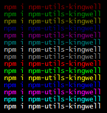
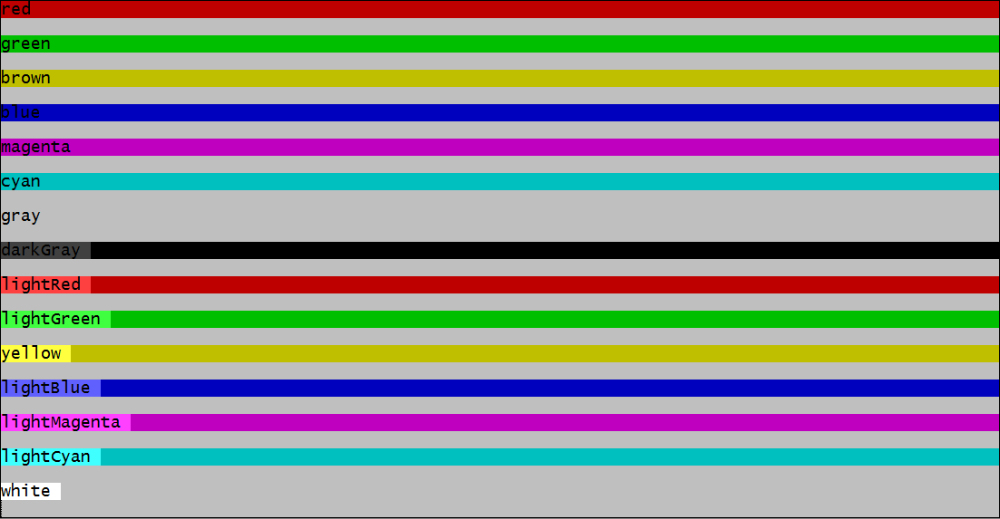

[![NPM info][nodei.co]][npm-url]
### Installation

	$ npm i npm-utils-kingwell
	$ npm i npm-utils-kingwell --save

### Require
	var utils = require('npm-utils-kingwell');

1. objectSort
2. deepCopy
3. slice
4. inArray
5. toDenseArray
6. delDupArray||delArray @description Delete Duplicates Array
7. strimHtml
8. getTimesTamp
9. fixNumber
10. getDateString
11. log||log.help()||success()||error()||info()||warn();

### Object sort

    /**
        * objectSort
        * @param  {Object}  source object
        * @param  {Number}  0 Or -1
        * @return {Object}        new Object;
    */
>utils.objectSort(source,sort);

    var obj1 = {
    	a: 1,
    	b: 2,
    	c: 3
    };
    var obj2 = utils.objectSort(obj1, 0);
    obj2 = {
    	a: 1,
    	b: 2,
    	c: 3
    };
    
    var obj3 = utils.objectSort(obj1, -1);
    obj3 = {
    	c: 3,
    	b: 2,
    	a: 1
    };
### log
	log(info,color);
	color === 
			black
			red
			green
			brown
			blue
			magenta
			cyan
			gray
			darkGray
			lightRed
			lightGreen
			yellow
			lightBlue
			lightMagenta
			lightCyan
			white
	
	utils.log('something','red');//color -> red	

### utils.log(msg,colorStyle)// colorStyle=> red,green,brown,blue....
#### utils.log.help() //output 

### utils.success(msg);
> output color //green

### utils.error(msg);
> output color //red

### utils.info(msg);
> output color //lightCyan

### utils.warn(msg);
> output color //yellow

### Interception string
	slice(String);	
	var str = 'abcdefghijklmnopqrstuvwxyz';
	console.log(utils.slice(str,3));//output 'abcd...'
	console.log(utils.slice(str,3,'-'));//output 'abcd-'
	console.log(utils.slice(str,3,'+'));//output 'abcd+'

### fixNumber
	
	utils.fixNumber(1,2);//output '01'
	utils.fixNumber(1,3);//output '001'
	utils.fixNumber(1,4);//output '0001'
	utils.fixNumber(1,5);//output '00001'

	utils.fixNumber.size = 3;
	utils.fixNumber(1);//output '001'
	utils.fixNumber(12);//output '012'
	utils.fixNumber(120);//output '120'

### getDateString
	getDateString(Date date,Boolean showTime);
	console.log(utils.getDateString(new Date)); //output 2016-08-10
	console.log(utils.getDateString(new Date),true); //output 2016-08-10 11:32:00

### toDenseArray
	var arr = [1,2,3,'',4];
	utils.toDenseArray(arr) //output [1,2,3,4]

### delArray
	var arr = [1,2,2,3,3,3,3,4];
	utils.delArray(arr); //output [1,2,3,4]

### inArray
	var arr = ['a','b','c']
	utils.inArray(b,arr); //output 1

### strimHtml
	var str = '
html
';
	utils.strimHtml(str);//output html;
